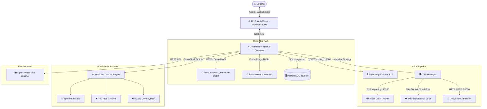

# ⚡ E.V.I. — Enhanced Virtual Intelligence

<div align="center">


**Asistente Táctico de Voz con Inteligencia Artificial 100% Local, Privacidad Absoluta y Cero Latencia**

[Características](#-características-principales) •
[Arquitectura](#-arquitectura-del-sistema) •
[Requisitos](#-requisitos-del-sistema) •
[Instalación](#-guía-de-instalación-rápida) •
[Comandos Soportados](#-comandos-de-voz-y-capacidades)

</div>

---

## 🌟 Características Principales

- 🧠 **Cerebro LLM 100% Local:** Impulsado por **Qwen3-8B** cuantizado en GGUF corriendo sobre `llama.cpp` con aceleración CUDA en GPU NVIDIA.
- 📚 **RAG Híbrido & Memoria Persistente:** Base vectorial con **PostgreSQL + pgvector** y embeddings **BGE-M3** (1024 dims) para almacenamiento permanente de documentos, preferencias y memoria conversacional multi-turno.
- 🎙️ **Speech-to-Text (STT) Instantáneo:** Transcripción ultrarrápida en español mediante **Whisper** sobre protocolo Wyoming.
- 🗣️ **Arquitectura Modular de Motores TTS (Strategy Pattern):**
  - **Microsoft Neural (Edge-TTS):** Voces ultra naturales en español (*Dalia, Paloma, Camila, Salomé, Elvira*).
  - **Piper TTS (Local Docker):** Síntesis instantánea offline en menos de 60ms (*Claude es_MX, Dave es_ES*).
  - **CosyVoice 3 (Alibaba FunAudioLLM):** Clonación Zero-Shot y voces neuronales expresivas.
  - **Chatterbox TTS:** Motor local de clonación de voz.
- 🎛️ **Panel Web Cyberpunk / HUD Reactivo:** Interfaz inspirada en *Spider-Man: Brand New Day* y *F.R.I.D.A.Y.* con visualizador de espectro de audio en tiempo real y selector de motor/voz al vuelo.
- 🖥️ **Control Nativo del Sistema Operativo (Windows Automation):**
  - Reproducción multimedia automática en **YouTube** y **Spotify**.
  - Control de volumen (subir, bajar, mutear, porcentaje exacto).
  - Apertura y cierre de aplicaciones (*Chrome, VS Code, Spotify, Bloc de notas, etc.*).
  - Minimizado general y captura de pantalla.
- 🌦️ **Servicio Meteorológico en Vivo:** Integración con **Open-Meteo** (100% gratuito sin API keys) para clima, temperatura, sensación térmica y pronóstico diario con geocodificación global.

---

## 🏗️ Arquitectura del Sistema



---

## 💻 Requisitos del Sistema

| Componente | Requisito Mínimo | Recomendado |
|---|---|---|
| **Sistema Operativo** | Windows 10 / 11 (64-bit) | Windows 11 |
| **GPU** | NVIDIA con 6 GB VRAM (CUDA 12+) | NVIDIA RTX 3060 12GB o superior |
| **RAM** | 16 GB | 32 GB |
| **Node.js** | v20.x o superior | v22.x LTS |
| **Python** | v3.10 o superior | v3.11.x con PyTorch CUDA |
| **Docker** | Docker Desktop con WSL2 | Docker Desktop activo |

---

## 🚀 Guía de Instalación Rápida

### 1. Clonar el repositorio
```powershell
git clone https://github.com/TU_USUARIO/evi-ai-assistant.git
cd evi-ai-assistant
```

### 2. Configurar Variables de Entorno
Copia el archivo de plantilla `.env.example` y renómbralo a `.env`:
```powershell
Copy-Item .env.example .env
```

### 3. Instalar Dependencias del Orquestador
```powershell
cd orchestrator-nest
npm install
npm run build
cd ..
```

### 4. Iniciar Contenedores Docker (PostgreSQL pgvector, Piper, Whisper)
```powershell
docker compose up -d
```

### 5. Lanzar Todo el Ecosistema con un Solo Comando
El proyecto cuenta con un script inteligente que verifica puertos, modelos y dependencias antes de levantar los servicios:
```powershell
.\start-all.ps1
```

Abre tu navegador en:
👉 **`http://localhost:3000`**

---

## 🎙️ Comandos de Voz y Capacidades

### 🎵 Multimedia y Entretenimiento
- *"Pon In The End de Linkin Park en YouTube"*
- *"Pon una playlist de lofi en Spotify"*
- *"Sube el volumen al 50%"* / *"Baja el volumen un poco"*
- *"Pausa la música"* / *"Sigue con la música"*

### 🌦️ Clima e Información en Tiempo Real
- *"¿Cómo está el clima hoy en Lima?"*
- *"¿Qué temperatura hace en Madrid?"*
- *"¿Va a llover en Arequipa hoy?"*
- *"¿Qué hora es?"*

### 🖥️ Control de Windows y Productividad
- *"Abre Visual Studio Code"* / *"Abre Chrome"*
- *"Cierra Spotify"* / *"Cierra la calculadora"*
- *"Toma una captura de pantalla"*
- *"Minimiza todo"*

### 💬 Conversación y Asistencia Técnica
- *"Hola EVI, ¿estás lista?"*
- *"Explícame cómo funciona la indexación HNSW en pgvector"*
- *"No necesito nada, solo quiero charlar contigo un rato"*

---

## 🎛️ Barra de Control de Voz en la Web UI

En la parte superior de la interfaz web puedes alternar motores y parámetros en tiempo real:

| Parámetro | Opciones Disponibles |
|---|---|
| **Motor TTS** | `Microsoft Neural (Edge-TTS)`, `Piper TTS (Local)`, `CosyVoice 3`, `Chatterbox` |
| **Voces** | `Dalia (Latino)`, `Paloma (USA/Latino)`, `Camila (Perú)`, `Salomé (Colombia)`, `Claude (Local)`, `Elvira (España)` |
| **Velocidad** | Slider ajustable en vivo desde `-20%` hasta `+50%` |

---

## 📂 Estructura del Repositorio

```
jarvis-local/
├── orchestrator-nest/           # Servidor Backend NestJS + Gateway WebSocket
│   ├── src/jarvis/
│   │   ├── tts/                # Proveedores modulares (Piper, Edge, CosyVoice, Chatterbox)
│   │   ├── llm.service.ts      # Cliente LLM streaming con Qwen3-8B
│   │   ├── rag.service.ts      # Motor RAG vectorial con pgvector
│   │   ├── weather.service.ts  # Servicio de clima Open-Meteo
│   │   └── windows.service.ts  # Automatización nativa de Windows
│   └── public/                 # Frontend Web HUD (HTML5, Vanilla CSS, JS)
├── cosyvoice-service/          # Microservicio FastAPI de CosyVoice 3
├── knowledge/                  # Base de conocimiento en Markdown para RAG
│   ├── capabilities/           # Capacidades, límites y comandos
│   └── personality/            # Identidad, tono y reglas de EVI
├── docker-compose.yml          # PostgreSQL pgvector, Piper TTS, Whisper STT
├── start-all.ps1               # Script maestro de arranque del ecosistema
└── .env.example                # Plantilla de variables de entorno
```

---

## 📄 Licencia

Este proyecto está bajo la licencia **MIT**. Siéntete libre de modificarlo, extenderlo y adaptarlo a tu propio hardware.

---

<div align="center">
Desarrollado con ❤️ para llevar la computación e inteligencia artificial local al siguiente nivel.
</div>
